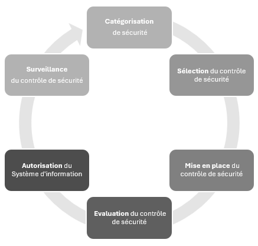

<h1 align="center">
  
</h1>

  
CISSP <strong>ISC2</strong>

  
<strong>Chapter 1 : Security and risk management</strong>

  <a href="https://github.com/git-bd/cissp/issues/new?assignees=&labels=bug&template=01_BUG_REPORT.md&title=bug%3A+">Report a Bug</a>
  ·
  <a href="https://github.com/git-bd/cissp/issues/new?assignees=&labels=enhancement&template=02_FEATURE_REQUEST.md&title=feat%3A+">Request a Feature</a>
  .
  <a href="https://github.com/git-bd/cissp/discussions">Ask a Question</a>

 

✅**A savoir**  ℹ️**Information**  ‼️**Alerte** 🔗**Liens** ✏️**Illustration**  🔎**A approfondir**   

## Sommaire
 

 

# Understand and Apply Security Concepts
## ✅Confidentiality
`Confidentialité` est souvent associé à la notion de : 
* **Contrôle d'accès** : *Objet* élément passif(fichier, ordinateur, etc), *sujet* élément actif (utilisateur, programmes, ordinateur)
* **Sensitivity**, sensibilité les données doivent être classifées
* **Discretion**, uniquement ce qui est nécessaire
* **Criticality**, quels sont les seuils de criticité
* **Concealment**, Dissimulation pour limiter les accès
* **Secrecy**, Restreindre les accès
* **Privacy**, confidentialité
* **Seclusion**, isoler, mettre à l'écart ou bloquer(sandBox)
* **Isolation**, ne pas mélanger (VLAN, ZeroTrust) 

## ✅Integrity
`Intégrité` assurer la fiabilité des données
* **Accuracy**, correct et précis
* **Truthfulness**, reflète la réalité
* **Authenticity**, conformité
* **Validity**, valable et factuel
* **Nonrepudiation**, qui ne peut être nié
* **Accountability**, rendre compte de ses actions
* **Responsability**, obligations, avoir le contrôle
* **Completeness**, avoir l'exhaustivité des composants
* **Comprehensiveness**, inclusion complète et inaltérée

## ✅Availability
`Disponibilité` timely accés à temps et tout ce temps
* **Usability**, facile à utiliser
* **Accessibility**, assurance de la consommation des ressources
* **Timeliness**, rapidité 

## ℹ️Limitation of the CIA
* **Confidentiality**
* **Integrity**
* **Availability**
* **Authenticity**
* **Utility**
* **Possession or control**

# Evaluate and Apply Security Governance Principles
## ✅Alignment of the Security Function to Business Strategy, Goals, Mission and Objectives

**Security governance** est la base de toutes organisation, planification, procédures. La gouvernance de la sécurité est l'ensemble des pratiques liées à al définition, la direction des effort de sécurité d'une organsiation souvent lié à la gouvernance de l'entreprise et des processus métier. 
* **Mission statement** :
* **business strategy** :
* **SMART** :

* **Plan** : Il est nécessaire de connaître ces éléments
> 1. Définir les rôles
> 2. Prescrire la façon dont la sécurité sera gérée
> 3. Nommer qui sera le responsable de la sécurité
> 4. Définir les tests de sécurité
> 5. Définir la politique de sécurité
> 6. réaliser une analyse de risques
> 7. Former et sensibiliser

## ✅Organizational Processes
* **Governance Committees**
* **Mergers and Acquisitions** : ajouter des inconnue des nouveau vecteurs d'attaques en fonction de l'entrprise acquise et son/ses SIs
* **Divestitures**

**Top-Down** : de la direction générale (C-level) vers les utilisateurs, apporte la `légitimité` et permet les `adaptations nécessaires` en tenant compte des impératifs. La Direction est chargé de définir la politique de l'organisation qui permet une orientation. la mise en oeuvre des **standards**, **baselines**, **guidelines** and **procedures** doit être faite par les différentes équipes et ces derniers doivent être connues et appliquées des utilisateurs concernés.

## ✅Organizational Roles and Responsabilities

* **CISO** `RSSI`: Chief information Security Officer, la gestion de la sécurité reste de la responsabilité de la Direction Général (non limité aux responsables informatique), l'équipe sécurité doit être autonome et dirigé par le RSSI qui rend compte directement au Directeur Général. Cela permet d'améliorer l'organsiation et son indépendance (sans partie pris).
* **CSO** : Chief Security Officer
* **Security Analyst** : est le professionnel de la sécurité `CIRT`, il est reponsable du changement fonctionnel et rédige la politique de sécurité ils ne sont pas décideurs cela est dédié aux Managers / Seniors Managers. 
* **Managers** : Responsables final doit approuver (Sign off) les politiques de sécurité il est le `Due Care` et `Due Diligence` il ne fait pas la configuration qui est dédié aux professionnels de la sécurité. 
* **Director** : C-Level
* **Users** : Least Privilege responsable de la compréhension et du respect (upholding)
* **Auditeur** : Responsable de l'examen et de la vérification . Il  produit des rapports de conformité  et d'efficacité  ce qui permet de définir de nouvelles directives. 

## ✅Security Control Frameworks
`SCF`Ils permettent de structurer l'organisation par la sécurité.
* **ISO/IEC 27001** : International Organization for Standardization and International Electrotechnical Commission, la 27001 est lié à `ISMS` Information Security Management System.
* **ISO/IEC 27002** : International Organization for Standardization and International Electrotechnical Commission, la 27002 est lié aux bonnes pratiques
* **NIST 800-53** : National Intitute of Standard and Technology est lié à la *Security and Privacy Controls for Federal Information Systems and Organization*
* **NIST 800-100** :
* **NIST Cybersecurity Framework** : National Intitute of Standard and Technology est ensemble de standard et guideline.
* **CIS** : Critical Security Controls
* **COBIT** : **ISACA** C'est le plus lrgement utilisé il prescrit les objectifs et les exigences pour les contrôle de sécurité, il relie fortement les enjeux de sécurité aux enjeux commerciaux. 
* **ANSSI**

ℹ️**Information**, Il est possible de connaître les chapitres ou thème abordés dans les publications ci-dessus.

✏️Les 5 principes de COBIT : Slide 47

## ✅Due Care Due Diligence

* **Due Care** : se base sur la bonne volontée comme la politique de sécurité via des mesure raisonnable ou appropriées.
Définition de politique, stratégie, référetiels
* **Due Diligence** : mise en application et vérification nécessaire via investigation et évaluations approfondies; audits, pentests, etc. Application des politique, référentiels et strétégies.

# Determine Compliance and Other Requirements
* **Compliance** : 

## Legislatives and Regulatory 
* **U.S. CSA 1987** : U.S Computer Security Act de 1987, 
* **FISMA** : Federal Information Security Management Act de 2002, 

## ✅ Industry Standard and Other Compliance Requirements

* **SOC** : System and Organization Controls sont des frameworks d'audit lors des évaluations de sécurité.
> * SOC1 : se concentre sur une description des mecanismes de sécurité pour évaluer leur adéquation, principalement dédié aux entreprises `financières`.
> * SOC2 : Se concentre sur des contrôles de sécurité mis en oeuvre en matière de disponibilité, sécurité, intégrité et confidentialité. principalement dédié au partenaire commerciaux, client pour avoir la vision de la sécurité. il existe 2 type : I contrôle à un moment donnée, II contrôle sur une période donnée.  
> * SOC3 : version condensé et public du SOC2, il ne contient pas les détails pour le grand public ou marketing. 

* **PCI-DSS** : Payment Card Industry Data security Standard

* **Sarbanes-Oxley Act** : loi qui réglemente les fonctions dinancières comptables et d'audit. 

## ✅ Privacy Requirements

* **PII** : Personal Identifiable Information 

ℹ️**Information** 
Les thèmes des réglementation ci-dessus peut être ajouté ici

# Understand Legal and Regulatory Issues That Pertain to Information Security in a Holistic Context
## ✅Cybercrimes and DataBreaches

Les acronymes et leur rôles principales

* **CFAA** : Computer Fraud and Abuse Act Page 31 CBK
* **NIIPA**

ℹ️**Information**

* **ECPA** : Electronic Communications Privacy Act
* **EEA** : Economic Espionage Act
* **CPPA** : Child Pornography Prevention Act
* **ITADA** :Identity Theft and Assumption Detererrence Act
* **USA PATRIOT ACT** :
* **Homeland Security Act** :
* **CAN-SPAM** :
* **Intelligence Reform and Terrorism Prevention Act** :
Les thèmes des réglementation ci-dessus peut être ajouté ici

## ✅Licencing and Intellectual Property Requirements

* **Copyright**
* **DMCA**
* **FAI/ISP**
* **Trademark** : c'est une protection légale sur les mots, solgans et logos le fameux `tm`. la reconnaissance officielle se fait via un enregistrement `USPTO` US Patent and Trademark Office ®️: cela est valable 10 ans ne doit prêter à confusion et ne doit pas être descriptif.
* **Patents** : le brevet est valable 20 ans, pour une solution nouvelle et utile, 
* **Trade Secret** : utilisé pour les logiciels informatique, la loi Economic Espionnage Act qui peut imposer 500M$ et 15 ans de prison (si vol d'une société Américaine) et 250M$ et 10 si autre société. 
* **Licencing** : 

## ✅Import/Export Controls

Cela concerne l'import et l'export de matériel d'équipement notamment les équipements de chiffrements qui était lié comme des armes de guerre. 
* **ITAR** : Internationnal Traffic in Arms Regulations
* **EAR** : Export Administration Regulation,
* **Contrôles d'exportation de chiffement**

ℹ️**Information**
Certains accès sont libre cela dépends des pays notamments ou des nouvelles lois comme le contrôle d'exportation de chiffrement qui a été mis à libre. 

## Transborder Data Flow

ℹ️**Information**
ITAR vs EAR , NSA

## ✅Privacy

Il est nécessaire de connaître les première loi américaine qui sont citée dans l'examen. 
* **4ème amendement** : perquisitions et saisies reuière nt un mandat
* **Fedreal Privacy Act 1974** : année loi sur la protection de la vie privée 
* **ECPA** :
* **CALEA** :
* **1996** :
* **HIPAA** : Health Insurance Portability and Accountability Act, Loi sur l'assurance maladie (US)

* **HITECH** :
* **PII** : Personnally identifiable information, numéro de sécurité sociale, 
* **COPPA** : Children's Online Privacy Protection Act 1998
* **GLBA** : Gram-Leach Bliley Act, loi pour contrôler la manière dont les institutions financières traite les informations  privées des individus.
* **FERPA** : Family Educational Right and Privacy Act, loi sur les droits éducatifs de la famille et la vie privé.
* **USA Patriot Act** : 2001
* **ITAD** : Identify Theft and Asumption Deterrence Act 1998
* **GDPR** : General Data Protection Reglementation, notification des violation dans les 72h00, centralisée, individu ont accès à leur propore données, portabilité, droit à l'oubli
* **Privacy Shield** : accord Etat-Unis et Unions Européennes export des données européennes vers les produits américains en fonction des lois Européenne, cela change beaucoup en fonction des gouvernements et géo-politique. 

# ✅Understand Requirements for Investigation Types
##  Administrative
## Criminal
## Civil
## Regulatory
## Industry Standard

# ✅Develop, Document and Implement Security Policy, Standards, Procedures and Guidelines
## Policies
**Mandatory/Compulsory** `Obligatoire`, la politique de sécurité est une définition étendue de la sécurité, elle aborde les assets nécessitant une sécurité avec les solutions adéquates et nécessaires. Elle définie les principaux objectifs et domaine de sécurité, elle permet de clarifier et définir les terminologies. 
Elle permet également d'attribuer les responsabilité, rôles, exigences et audit. Il représente le `Due Care`.

Il existe 3 types de politiques: 
* **Organizational** : élement pertinent d'une organisation
* **Issue-Specific** : se concentre sur un problème  rencontrée, infrastructure ou organisationnel
* **System-Specific** : Spécifie le type de systèmes à prendre en compte ou les contrôles de sécurité sur un système donné

Il existe 3 catégories de politiques: regularory, Advisory et Informative.

## Standards
**Standard/Normes** `Obligatoire`, fourni un plan d'action pour la mise en oeuvre des procédures et guideline, Ils sont tactique ils définissent les étapes ou les mthodes pour atteindre  les objectifs. 
Il est souvent associé au `BaseLine`qui lui est (discretionary | facultatif) Il définit un niveau minimum de sécurité lié à l'opérationnel avec des objectifs ets ses exigence. Les Baseline sont souvent specifiques au système: TSEC, ITSEC, NIST.

## Procedures
**Mandatory/Compulsory** `Obligatoire`, une procédure opérationnelle standard `**SOP** Standard Operating Procedure` est nu document détaillé qui décrit les action étape par étape et spécifique au système. Elles sont garantes de la standardisation. 

## Guidelines
**discretionary** `facultatif`, proposer des recommandation sur les façon dont les normes et les baseline sont mises en oeuvre, sert de guide opérationnel, flexible, représente ce qui est déployé et les méthodologies mise en oeuvre. 

✏️ Pyramide des documents slide 50

**planification de la sécurité**, `STO : Strategic, Tactic, Operational`
* Strategic plan : annuel il doit contenir l'évaluation des risques (risk assessment), il définit l'object de sécurité de l'organisation.
* Tactical plan : moyen terme, fourni plus de détail sur la réalisation des objectifs
* Operational Plan : court terme et très détaillé, il contient les allocations de ressource, de budget, de personnel et les procédure étape par étape. 

# ✅Identify, Analyze and Prioritize Business Continuity Requirements
* **BC** :
* **DR** :
* **BCP** :
* **DRP** :
* **CDF** :

## Business Impact Analysis

* **BIA** :
* **MTD** :
* **RTO** :
* **RPO** :

## ✅Develop and Document the Scope and the Plan
Les thèmes des réglementation ci-dessus peut être ajouté ici

# Contribute to and Enforce Personnel Security Policies and Procedures 
## ✅Candidate Screening and Hiring
L'humain est l'élément le plus faible de toutes solutions de sécurité. Les process de séparation des tâches ou responsabilité `separation of dutie`et les rotations des postes réduisent les collusions, les collaborations par entraide pour faire avancer les sujets en mettant en péril la sécurité du bien.
* **Separation of Dutie** :  chaque entité à sa reponsabilité son activité, les tâches sensibles ou critiques sont réparties entre plusieurs individus par principe de moindre privilege.
* **Responsabilité du poste** : tâche de travail spécifique sur la base du moindre privilege. 
* **Rotation des postes** : 🔎redondance des connaissance, évite l'utilisation abusive des informations, de vol ou risque de fraude. on parle parfois aussi de formation polyvalente permettant la prsie de connaissance en préparation d'une rotation possible des postes.
* **Embauche** : cette étape permet la vérification des antécédants `Background Checks`la vérifications des références, scolaire, connaissance et habilitation en sécurité, etc.

## ✅Employment Agreements and Policies
* **EA** : Employment Agreement, contrat de travail, il y décrit les règles et restriction de l'entreprise, la politique de sécurité, les règles , la description du poste, le temps du poste
* **NDA** : Non Disclosure Agreement, accord de non divulgation
* **NVA** : Non Compete Agreement, Accord de Non-Concurrence
* **Vacation**: les congés obligatoire

## ✅Onboarding, Transfers and Termination Processes
* **Onboarding**: processes d'ajout de nouveau employés au système de gestion `IAM` **Identity and Access Management** ou lors d'un changement de poste ou d'activité qui nécessite également une revue des accès acquis
* **Offboarding** : cette phase se fait en plusieurs étapes; désactivation des compte pendant une période, information des employés ou société de garde puis suppression des comptes après une certaines période. 

## ✅Vendor, Consultant and Contractor Agreement and Controls
* **SLA** : Service Level Agreement, ce contrat se base sur : la disponibilité du service, les temps maximum de downtime, charge acceptée, charge moyenne, responsabilité, temps de failover, etc

## ✅Compliance Policy requirements
Les employés doivent être formés sur ce qu'ils doivent faire.

## ✅Privacy Policy Requirements
* **Privacy** :La vie privée concerne le contrôle des accès aux informations personnellement identifiables, notamment les accès à ces données, l'utilisation de ces données. Cela concerne aussi la liberté d'être observé surveillé ou examiné sans consentement ou connaissance.
* **PII** : Personally Identifiable Information, concerne tout élément qui désigne une personne: un numéro de téléphone, mail, adresse postale, sécurité sociale, nom. 

‼️🔎Les données comme IP, MAC, etc ne sont pas considérées comme élément personnel sauf dans certains pays comme l'allemagne

# Understand and Apply Risk Management Concept
La gestion des risques est un procesus détaillé d'identifications des facteurs susceptibles d'endommager ou de divulguer des données d'évaluation des ces facteurs et la mises en oeuvre des solutions rentables pour atténuer les risques à un niveau acceptable.

## ✅Identify Threats and Vulnerabilities
Les objectifs de gestion des risques est faite par l'analyse des risques qui se base sur : 
* **Threats** : Menace, tout évènement pouvant entraîner un résultat indésirable pour une organisation ou un actif spécifique.
* **Vulnerabilities** : faiblesse d'un actif ou absence d'une protection (safeguard) ou d'une contre-mesure.
* **Asset** : Actif, tout ce qui se trouve dans un environnement et qui doit être protégé.
* **Asset Valuation** : valeur monétaire d'un actif
* **Exposure** : Qu'est ce qui est le pire qui puisse arriver ? 

## ✅Risk Assessment
L'évaluation des risques se reposent sur la formule: 
risk= Threat x Vulnerabilities. 

Lorsqu'un risque
Dessin des 6 phases : Inventorier, Menaces, Analyse, Potentiel, Contre-mesure et Analyse coûts/avantages
L'évaluation de risque se base sur différents éléments qui permettent de calculer le risque en fonction des différents éléments : AV, EF, SLE, ARO, ALE

Analyse de risque quantitative
* **AV** : Asset Value
* **EF** : Exposure Factor en **%** ou de **0 à 1** 
* **SLE** : Single Loss Expectancy est égale à **AV*EF**
* **ARO** : Annualized Rate of Occurence **X/an**
* **ALE** : Annualized Loss Expactancy est égal à **SLE*ARO**
* **ACS** : Annual Cost of Safeguard **€/an**
* Valeur de la sécurisation (toujours positif) **(ALE1-ALE2)-ACS**

### ✅Analyse de risque Quantitative vs Qualitative
Insérer le tableau et rerprendre les exemples précédent  (p97)

## ✅Risk Response / Treatment
Ce sujet n'abord pas le traitement du risque (attenuer, transférer, accepter ou supprimer) là on est sur la réponse du risque

Un risque peut être : 
* **Avoid** :
* **Mitigate** :
* **Transfert** :
* **Accept** :

## ✅Countermeasure Selection and Implementation
* **Personnel** :
* **Process** :
* **Technology** :

Security / Cost / Operational

## ✅Applicable Types of Controls
* **Preventative** *Préventif*
* **Detective** *Détectif*
* **Corrective** *Correctif*
* **Recovery** *Récupération*
* **Deterrent** *Dissuasif*

## ✅Control Assessments
**SCA** Security Control Assessment, représente une évaluation formelle des mécanismes individuels d'une infrastructure de sécurité en fonction de l'audit demandée, la référence `NIST 800-53A`.
Examine, Interview and Test

## ✅Monitoring and Measurement
KPI
## ✅Reporting

## ✅Continuous  Improvement

## ✅Risk Frameworks

**RMF** Risk Management Framework est une manière de gérer le risque. La publication `NIST 800-37' fournit une procédure possible se basant sur 6 étapes, le RMF se veut une gestion en temps réelle via l'automatisation: 
* Catégorisation de sécurité
* Sélection du contrôle de sécurité
* Mise en place du contrôle de sécurité 
* Evaluation du contrôle de sécurité
* Autorisation du Système d'information 
* Surveillance du contrôle de sécurité

Autre méthodes à savoir mais pas maîtriser les étapes 
* **FAIR** : Factor Anaslyse of information
* **TARA** : Threat Agent Risk Assessment

**International Standard Organization**
* **ISO 31000** :
* **NIST** : 
* **COBIT** : 
* **RikIT** : 

# Understand and Apply Threat Modeling Concepts and Methodologies

## ✅Threat Modeling Concepts
Les types d'approche de modélisation des menaces: 
* **proactive** (ou defensive):  Lors de la conception initiale, se base sur la prévision des menaces et la conception de défense spécifique. 
* **réactive** (contradictoire ou adversarial): se fait après le déploiement; pentest, fuzzing (test dynamique via différents points d'entrée), source code review

`SAA Sofware Assets Attackers`
* **Attacker-Centric** : se focalise sur les risques liés aux attaquants et non aux risques. 
* **Asset-centric** :  permet de prioriser les asset les plus importants suite aux pentests
* **Software-centric** : utile pour les entreprises de developpement de logiciel

## ✅Threat Modeling Methodologies
* **STRIDE** : Spoofing, Tamepering, Répudiation, Information Disclosure, Deny of Services, Elevation Privilege, c'est un outil de catégorisation de Microsoft. 

* **PASTA** : Process for Attack Simulation and Treat Analysis, composé en 7 étapes approche centré sur le risque 
* **NIST 800-154** : 
* **DREAD** : Dammage, Reproductibility, Exploitability, Affected Users, Discoverability, est un système de notation 
* **Autres** : 
>* **OCTAVE** :  Operational Critial Threat Asset and Vulnerability Evaluation 
>* **CORAS** : 
>* **VAST** : Visual, Agile and Aimple Threat gestion des menace et risque en mode Agile
>* **TRIKE** : Méthode openSource qui se base sur les risques et comprend un audit fiable et reproductible.

✏️ illustration des models (boucle, step, liste slide 60/61)

# Apply Supply Chain Risk Management Concepts
## ✅Risk Associated with Hardware, Software and Services
Lorsqu'on évalue un tiers pour l'intégration de la sécurité : 
* **On-Site Assessment** : visiter le site de l'organisation pour interroger le personnel et observer leur habitudes
* **Document Exchange and Review** : Etude qui se porte sur les moyens par lesquels les ensembles de données et la documentation sont échangés ainsi que les processus formel.
* **Process/Policy Review** : Demander et analyser les documents, procédures, etc

## ✅Third-Party Assessment and Monitoring

Audit par une tierce partie réalisé par un indépendant tel que `AICPA` **American Institue of Certified Public Accountants** peut fournir un examen impartial de l'infrastructure de sécurité sur la base des rapports `SOC` **Service Organization Control**. 

La `SSAE` **Statement on Standards for Attestation Engagements** est une réglementation qui définit la manière dont les organisations de service rendent compte de leur conformité via les différents rapport SOC. Exemple: SSAE 16 (2011), SSAE 18 (2017)

## ✅Minimum Security Requirement
* **MSR** : `Minimum Security Requirements`

## ✅Service-Level Requirements
* **SLA** : `Service-Level Requirements`

## ✅Frameworks
* **NIST IR 7622** :
* **ISO 28000** :
* **NCSC** :
* **NIST 800-64 Rev2** : considération sur la sécurité dans le cycle de vie du développement du système.
🔗 https://www.gsa.gov/portal/getMediaData?mediaId=185371
🔗 https://csrc.nist.gov/pubs/sp/800/64/r2/final

# Establish and Maintain a Security Awarness, Education and Training Program
## ✅Methods and Techniques to Present Awareness and Training
* **Social Engineering** :
* **Security Champions** :
* **Gamefication** :

## ✅Periodic Content Reviews

## ✅Program Effectiveness Evaluation
* **Training Metrics** :
* **Quizzes** :
* **Security awareness days or week** :
* **Inhernet Evaluation** :

# Summary
## Question / Remarks