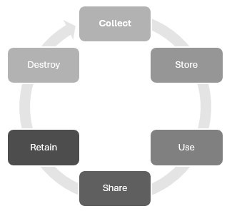

<h1 align="center">
  
</h1>

  
CISSP <strong>ISC2</strong>

  
<strong>Chapter 2 : Asset Security</strong>

  <a href="https://github.com/git-bd/cissp/issues/new?assignees=&labels=bug&template=01_BUG_REPORT.md&title=bug%3A+">Report a Bug</a>
  ·
  <a href="https://github.com/git-bd/cissp/issues/new?assignees=&labels=enhancement&template=02_FEATURE_REQUEST.md&title=feat%3A+">Request a Feature</a>
  .
  <a href="https://github.com/git-bd/cissp/discussions">Ask a Question</a>

 

✅**A savoir**  ℹ️**Information**  ‼️**Alerte** 🔗**Liens** ✏️**Illustration**  🔎**A approfondir**   

## Sommaire
 

 

# Identify and Classify Information and Assets
## ✅Data classification and Data Categorization

La classification des données ou catégorisation permet de créer des collections d'information ayant des similitudes: value, cost, sensitivity, risk, privilege, need to know. Il existe 3 types primaire de classification de données: Context-based, Content-based et User-based

✏️ Les critères de classification slide 38
**Valeur**
**Politique**
**Labels**
**American gouvernment**

✏️ Implémentation de classification slide 39

**Classification commercial ou secteur privé**
1. **Confidentiel** : extrêmment sensible
3. **Private** : données individuelle : privée ou personnelle à usage interne uniquement
4. **Sensitive** : impact négatif
5. **Public**

**Classification gouvernemental ou militaire**
1. **Top Secret** : la difulgation des données a un impact grave sur le système d'information
2. **Secret** : la difulgation des données représente un risque sur le système d'information
3. **Confidentiel** : Effet dit perceptibles
4. **Sensitive But Unclassified** : `SBU` uniquement dédié en interne `For Office Use Only`
5. **Unclassified** : pas de risque de confidentialité

ℹ️ L'armée se base plus sur la sensibilité et la confidentialité des données.

✏️ Pyramide des classes slide 41 

## ✅Asset Classification

**👍Benefit of Classification**

* Permet de protéger les ressources et les actifs précieux, critique
* Permet de définir les mécanisme adapté, réglementaire et ou légal 
* Permet de définir des niveau d'accès, les types d'utilisation, la déclassification et ou la destruction

**Asset Classification Levels**
N-Tiers

* **Données sensibles**
* **PII**
* **PHI**

# Establish Information and Asset Handling Requirements
## ✅Marking and labeling
* **DLP**

## ✅Handling
`Manipulation` L'entreprise doit définir la politique et les procédures de manipulation des données en fonction de leur classification. Il est important d'entrainer les utilisateurs pour réduire le risque. 

## ✅Storage
`Stockage` Le stockage des données (papier ou digitale) représente un risque concernant la gestion : coffre fort, chiffrement, etc.

## ✅Declassification
**De-identification** L'objectif est de retirer toutes données sensibles personnelles: masquer les données, offusquer, chiffrer ou les tokeniser.
**Tokenisation**  pseudonymisation mais avec des tokens
**Anomysization** Supression de toutes les données pertinentes comme le masquage il ne peut être reversible

Image p 107

# Provision Resources Securely
## ✅Information and Asset OwnerShip
## ✅Asset Inventory
* **Inventory Tools/System of Record**
* **Process  Considerations**

## ✅Asset Management
✏️ Asset livecycle

* **ITAM** : Information Technology Assest Management, ISO 19770
* **Configuration Management** : SCAP
* **Change Management** : ITIL, CMDB

# Manage Data lifecycle

## ✅Data Roles
1. **Owners** : Ceux sont les détenteurs des données ils décident de de qui peut faire quoi des données
2. **USers** : Utilisateur des données 
3. **Custodian** `Depositaire` : Il est le garant du bon maintient de l'environnement technique, du transport et du stockage  de façon sécurisée des données.
4. **Processors** :  on parle souvent du data-processos  par laquelle la value est consommée HIPAA et GDPR. 
5. **Subjects** : 
6. **Controllers** : C'est le régulateur de la façon et les raisons de l'utilisation des données. Pour le cloud le Data owners est toujours le client. 

## ✅Data Collection
## ✅Data Location
* **CII** : Critical Information Infrastructure
## ✅Data Maintenance
## ✅Data Retention
## ✅Data Destruction
## ✅Data Remanence
CD, SDD, ROM, RAM, FPGA, CRB, DBS

* **Clearing** :
* **Purging** :
* **Destruction** :
* **Zeroing** :
* **Overwriting** :
* **Degaussing** :

# Ensure Appropriate Asset Retention
## ✅Determining Appropriate Records Retention

## ✅Records Retention Best Practices

# Determine Data Security Controls and Compliance Requirements 
* **Technical controls** :
* **Administrative controls** :
* **Physical controls** :

## ✅Data States
* **Data at Rest** :
* **Data in Transit** :
* **Data in Use** :

## ✅Scoping and Tailoring
NIST 800-53

✏️ Tailoring Process
* **Common Controls** : Technical, Administrative and Physical
* **Compensation Security Controls** :

## ✅Standard Selection
* **Leading Security Framework** :
    NIST 800-37
    RMF
    NIST CF
* **Security Standard** : 
  NIST 800-53 Rev 5
  FIPS
  ISO

## ✅Data Protection Methods
* **DRM** : Digital Rights Management
* **DLP** : Data Lost Prevention
  Discovery and classification
  Monitoring
  Enforcement

  DLP at Rest
  DLP in Transit
  DLP in use

* **CASB** :  Cloud Access Security Broker

# Summary
## ✅Question / Remarks

Notes 
✅**A savoir**
* 
ℹ️**Information**
* **OCTAVE**
