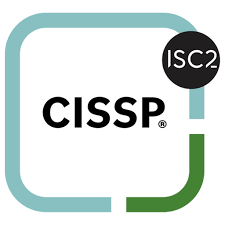

<h1 align="center">
  
</h1>

  
CISSP <strong>ISC</strong> ! 

  <a href="https://github.com/git-bd/cissp/issues/new?assignees=&labels=bug&template=01_BUG_REPORT.md&title=bug%3A+">Report a Bug</a>
  ·
  <a href="https://github.com/git-bd/cissp/issues/new?assignees=&labels=enhancement&template=02_FEATURE_REQUEST.md&title=feat%3A+">Request a Feature</a>
  .
  <a href="https://github.com/git-bd/cissp/discussions">Ask a Question</a>

 

# CISSP

Sommaire

 

* Security and risk management
* Asset security
* Security architecture and engineering
* Communication and network security
* Identity and access management
* Security assessment and testing
* Security operations
* Software development security

# Certification

En centre pearson view avec 2 pièces d'identité en aglais
  * 3h00 150 questions (Full) 
  * L'adaptatif: 100 questions 2h00  question les plus ardu
      1h00 de plus pour 50 questions 
  * 70% de bonne réponse
  * Réponse identique choisir le meilleur context et question en double négation

  Pour la suite c'est 1 point par heure de webinar 120h00 de webinar mini par an ou autre

Plan de formation sur 6 mois
  2h00 / jour pendant 5 mois
  Dernier mois tests blanc à chaque fois 
  Source de travail : 
    Reddit: r/cissp
    Support de test officiel Mike Chapple
    Examen poissble : `Boson`, LearnZapp
  
# Security and risk management

# Asset security

# Security architecture and engineering

# Communication and network security

# Identity and access management

# Security assessment and testing

# Security operations

# Software development security
